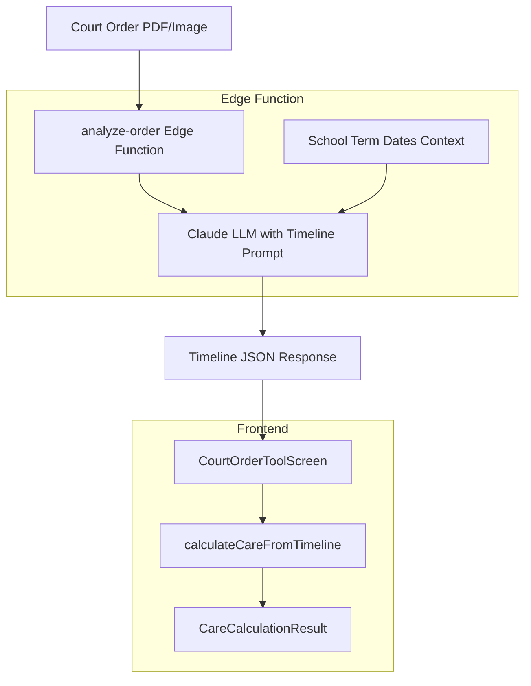

# Design Document

## Overview

This design refactors the Court Order Interpreter from a "Rule Extraction" architecture to a "Timeline Generation" architecture. The key insight is that simulating complex court order rules in TypeScript is error-prone and fails on edge cases. Instead, we leverage the LLM's ability to understand natural language court orders and generate a complete, minute-by-minute timeline for the entire year.

The new architecture has two main components:
1. **Timeline Generator (Edge Function)**: Prompts the LLM to output a strict JSON timeline covering 100% of the year
2. **Timeline Aggregator (TypeScript)**: Simple aggregation logic that sums minutes per parent and calculates statistics

This approach eliminates the complex simulation logic (730-day loops, carry-over rules, holiday detection) and replaces it with straightforward array iteration.

## Architecture



## Components and Interfaces

### 1. Timeline Block Type

```typescript
/**
 * A single block in the care timeline.
 * Format: [start_iso, end_iso, parent_code, type_code]
 */
type TimelineBlock = [string, string, 'M' | 'F', 'base' | 'holiday' | 'christmas'];

/**
 * The complete timeline response from the LLM.
 */
interface TimelineResponse {
  timeline: TimelineBlock[];
  year: number;
  primary_parent: 'M' | 'F';
}
```

### 2. Timeline Generator (Edge Function)

The Edge Function will be updated with:
- New system prompt instructing timeline generation
- School term dates context injection
- Year parameter handling

```typescript
// Request body interface
interface AnalyzeOrderRequest {
  fileBase64: string;
  mediaType: string;
  year?: number; // Default: 2026
}

// Response interface (success)
interface AnalyzeOrderResponse {
  timeline: TimelineBlock[];
  year: number;
  primary_parent: 'M' | 'F';
}

// Response interface (error)
interface AnalyzeOrderError {
  error: 'INVALID_DOCUMENT_TYPE';
  reason: string;
}
```

### 3. Timeline Aggregator

Replaces the CareCalculator class with a simple function:

```typescript
interface CareCalculationResult {
  totalDays: number;
  motherNights: number;
  fatherNights: number;
  motherPercentage: number;
  fatherPercentage: number;
  motherNightsPerYear: number;
  fatherNightsPerYear: number;
  timeline: TimelineBlock[]; // Include for calendar display
}

function calculateCareFromTimeline(response: TimelineResponse): CareCalculationResult;
```

### 4. School Term Dates Constant

```typescript
const TERM_DATES = {
  2026: {
    VIC: [
      { start: '2026-01-27', end: '2026-04-02' },
      { start: '2026-04-20', end: '2026-06-26' },
      { start: '2026-07-13', end: '2026-09-18' },
      { start: '2026-10-05', end: '2026-12-18' }
    ]
  },
  2027: {
    VIC: [
      { start: '2027-01-28', end: '2027-03-25' },
      { start: '2027-04-12', end: '2027-06-25' },
      { start: '2027-07-12', end: '2027-09-17' },
      { start: '2027-10-04', end: '2027-12-17' }
    ]
  },
  2028: {
    VIC: [
      { start: '2028-01-28', end: '2028-03-31' },
      { start: '2028-04-18', end: '2028-06-30' },
      { start: '2028-07-17', end: '2028-09-22' },
      { start: '2028-10-09', end: '2028-12-21' }
    ]
  }
};
```

## Data Models

### Timeline Block Structure

Each timeline block is a tuple representing a continuous period of care:

| Index | Field | Type | Description |
|-------|-------|------|-------------|
| 0 | start | string | ISO datetime with minute precision (e.g., "2026-01-01T00:00") |
| 1 | end | string | ISO datetime with minute precision (e.g., "2026-01-07T15:30") |
| 2 | parent | 'M' \| 'F' | Parent code - Mother or Father |
| 3 | type | string | Care type - "base", "holiday", or "christmas" |

### Example Timeline

```json
{
  "timeline": [
    ["2026-01-01T00:00", "2026-01-03T15:30", "M", "holiday"],
    ["2026-01-03T15:30", "2026-01-10T08:30", "F", "holiday"],
    ["2026-01-10T08:30", "2026-01-17T15:30", "M", "base"],
    ["2026-01-17T15:30", "2026-01-24T08:30", "F", "base"]
  ],
  "year": 2026,
  "primary_parent": "M"
}
```

### Aggregation Algorithm

```
1. Initialize motherMinutes = 0, fatherMinutes = 0
2. For each block [start, end, parent, type]:
   a. Parse start and end as Date objects
   b. Calculate duration = end - start (in minutes)
   c. Add duration to motherMinutes or fatherMinutes based on parent
3. Calculate nights using midnight rule:
   a. For each day in the year, check which parent has care at 23:59
   b. Count nights per parent
4. Calculate percentages: nights / 365 * 100
5. Return CareCalculationResult
```


## Correctness Properties

*A property is a characteristic or behavior that should hold true across all valid executions of a system—essentially, a formal statement about what the system should do. Properties serve as the bridge between human-readable specifications and machine-verifiable correctness guarantees.*

### Property 1: Year Boundary Coverage

*For any* valid timeline for a given year, the first block must start at January 1st 00:00 and the last block must end at December 31st 23:59 of that year.

**Validates: Requirements 2.1**

### Property 2: Continuous Coverage (No Gaps)

*For any* valid timeline, for all consecutive block pairs (block[i], block[i+1]), the end time of block[i] must exactly equal the start time of block[i+1]. If any gap exists, the validation function must return an error.

**Validates: Requirements 2.2, 2.4, 2.5**

### Property 3: Total Minutes Conservation

*For any* valid timeline covering a full year, the sum of all block durations (motherMinutes + fatherMinutes) must equal the total minutes in that year (525,600 for non-leap years, 527,040 for leap years).

**Validates: Requirements 4.1**

### Property 4: Midnight Rule Night Counting

*For any* valid timeline and any day within the year, the night is attributed to the parent who has care at 23:59 of that day. The sum of motherNights + fatherNights must equal 365 (or 366 for leap years).

**Validates: Requirements 4.2**

### Property 5: Percentage Sum Invariant

*For any* valid CareCalculationResult, motherPercentage + fatherPercentage must equal 100 (within floating-point tolerance of ±0.1 due to rounding).

**Validates: Requirements 4.3**

### Property 6: Round-trip Serialization

*For any* valid timeline array, formatting the timeline to a string and then parsing it back must produce an equivalent timeline array.

**Validates: Requirements 8.3**

## Error Handling

### Timeline Validation Errors

| Error Code | Condition | User Message |
|------------|-----------|--------------|
| `INVALID_TIMELINE_GAPS` | Gaps detected between blocks | "The generated timeline has gaps. Please try again." |
| `INVALID_TIMELINE_BOUNDS` | Timeline doesn't cover full year | "The timeline doesn't cover the full year." |
| `INVALID_BLOCK_FORMAT` | Block doesn't match expected format | "Invalid timeline format received." |

### Document Validation Errors

| Error Code | Condition | User Message |
|------------|-----------|--------------|
| `INVALID_DOCUMENT_TYPE` | Document is a template/guide | "Document appears to be a generic guide/template and not a specific court order." |

### API Errors

| Error Code | Condition | User Message |
|------------|-----------|--------------|
| `LLM_ERROR` | Claude API failure | "Analysis service temporarily unavailable. Please try again." |
| `PARSE_ERROR` | JSON parsing failure | "Could not parse the analysis result." |

## Testing Strategy

### Unit Tests

Unit tests will cover:
- Timeline block parsing and validation
- Duration calculation for individual blocks
- Midnight rule implementation for specific dates
- Error handling for malformed timelines

### Property-Based Tests

Property-based tests will use a testing library (e.g., fast-check for TypeScript) to verify:

1. **Year Boundary Coverage**: Generate random valid timelines and verify boundaries
2. **Continuous Coverage**: Generate timelines and verify no gaps exist
3. **Total Minutes Conservation**: Generate timelines and verify minute sums
4. **Midnight Rule**: Generate timelines and verify night attribution
5. **Percentage Sum**: Generate results and verify percentage invariant
6. **Round-trip Serialization**: Generate timelines, format, parse, compare

Each property test will run a minimum of 100 iterations.

### Test Configuration

```typescript
// Property test annotation format
// Feature: court-order-timeline-refactor, Property 1: Year Boundary Coverage
// Validates: Requirements 2.1
```

### Integration Tests

Integration tests will cover:
- End-to-end flow from document upload to result display
- Error handling for invalid documents
- Year parameter passing to Edge Function
