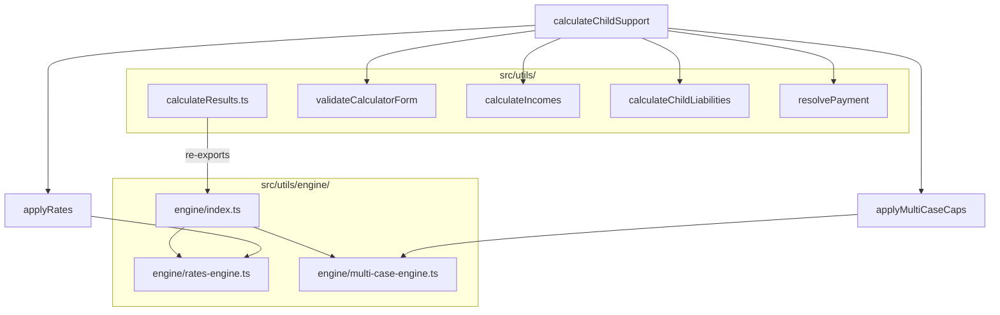

# Design Document: Refactor calculateResults.ts

## Overview

This design refactors the monolithic `calculateResults.ts` (~580 lines) into focused, single-responsibility modules organized under `src/utils/engine/`. The refactoring separates concerns while maintaining backward compatibility and identical calculation results.

The current file handles:
- Form validation
- Income calculations (CSI, CCSI, income percentages)
- Child cost lookups
- Per-child liability calculations
- FAR/MAR rate application
- Multi-case caps (Formula 3)
- Final payment resolution

## Architecture



## Components and Interfaces

### 1. Form Validator (`src/utils/form-validator.ts`)

Extracted validation logic with no changes to behavior.

```typescript
// Input/Output types (existing)
import { CalculatorFormState, FormErrors } from './calculator';

// Exported function
export function validateCalculatorForm(formState: CalculatorFormState): FormErrors;
```

### 2. Income Calculator (`src/utils/income-calculator.ts`)

Handles all income-related calculations.

```typescript
import { AssessmentYear } from './child-support-constants';
import { RelevantDependents, AgeRange } from './calculator';

export interface IncomeCalculationResult {
  ATI_A: number;
  ATI_B: number;
  relDepDeductibleA: number;
  relDepDeductibleB: number;
  preliminaryCSI_A: number;
  preliminaryCSI_B: number;
  CSI_A: number;
  CSI_B: number;
  CCSI: number;
  incomePercA: number;
  incomePercB: number;
  multiCaseAllowanceA: number;
  multiCaseAllowanceB: number;
}

export interface IncomeCalculationInput {
  incomeA: number;
  incomeB: number;
  relDepA: RelevantDependents;
  relDepB: RelevantDependents;
  multiCaseChildrenA: { age: number }[];
  multiCaseChildrenB: { age: number }[];
  currentCaseChildren: { age: number }[];
  selectedYear: AssessmentYear;
}


// Exported functions
export function calculateIncomes(input: IncomeCalculationInput): IncomeCalculationResult;

export function createVirtualDependentChildren(
  relDep: RelevantDependents
): { age: number; ageRange: AgeRange; careA: number; careB: number }[];

export function calculateCSI(
  ATI: number,
  SSA: number,
  relDepDeductible: number,
  multiCaseAllowance: number
): number;

export function calculateIncomePercentages(
  CSI_A: number,
  CSI_B: number
): { incomePercA: number; incomePercB: number };
```

### 3. Liability Calculator (`src/utils/liability-calculator.ts`)

Handles per-child liability calculations.

```typescript
import { ChildResult } from './calculator';

export interface LiabilityInput {
  age: number;
  ageRange: AgeRange;
  careA: number;
  careB: number;
  careNPC: number;
  incomePercA: number;
  incomePercB: number;
  costPerChild: number;
  hasNPC: boolean;
}

export interface LiabilityResult {
  roundedCareA: number;
  roundedCareB: number;
  roundedCareNPC: number;
  costPercA: number;
  costPercB: number;
  costPercNPC: number;
  childSupportPercA: number;
  childSupportPercB: number;
  liabilityA: number;
  liabilityB: number;
  liabilityToNPC_A: number;
  liabilityToNPC_B: number;
  isAdultChild: boolean;
  isTurning18: boolean;
}

// Exported functions
export function calculateChildLiability(input: LiabilityInput): LiabilityResult;

export function calculateChildSupportPercentage(
  incomePercent: number,
  costPercent: number
): number;

export function shouldPayLiability(
  receiverCare: number,
  npcCare: number,
  hasNPC: boolean
): boolean;
```

### 4. Rates Engine (`src/utils/engine/rates-engine.ts`)

Consolidated FAR/MAR rate application logic.

```typescript
import { AssessmentYear } from '../child-support-constants';
import { ChildResult } from '../calculator';


export interface RateEligibilityInput {
  ATI: number;
  SSA: number;
  MAX_PPS: number;
  receivesSupport: boolean;
  carePercentages: number[];  // Care % for each assessable child
  otherParentCarePercentages: number[];  // Other parent's care %
}

export interface RateApplicationResult {
  marApplies: boolean;
  farApplies: boolean;
  marAmount: number;
  farAmount: number;
  appliedRates: string[];
  rateApplied: string;
}

export interface ApplyRatesInput {
  childResults: ChildResult[];
  eligibilityA: RateEligibilityInput;
  eligibilityB: RateEligibilityInput;
  selectedYear: AssessmentYear;
  assessableChildCount: number;
}

export interface ApplyRatesResult {
  childResults: ChildResult[];
  finalLiabilityA: number;
  finalLiabilityB: number;
  FAR_A: number;
  FAR_B: number;
  MAR_A: number;
  MAR_B: number;
  rateApplied: string;
  appliedRates: string[];
}

// Exported functions
export function checkMARApplies(input: RateEligibilityInput): boolean;

export function checkFARApplies(
  input: RateEligibilityInput,
  childIndex: number
): boolean;

export function applyRatesToChildren(input: ApplyRatesInput): ApplyRatesResult;
```

### 5. Multi-Case Engine (`src/utils/engine/multi-case-engine.ts`)

Consolidated multi-case cap logic with optimized helper functions.

```typescript
import { AssessmentYear } from '../child-support-constants';
import { ChildResult, OtherCaseChild, AgeRange } from '../calculator';

export interface SoloCostInput {
  parentPreliminaryCSI: number;
  assessableChildren: { age: number; ageRange: AgeRange }[];
  otherCaseChildren: OtherCaseChild[];
  selectedYear: AssessmentYear;
}

export interface MultiCaseCapInput {
  childResults: ChildResult[];
  hasMultiCaseA: boolean;
  hasMultiCaseB: boolean;
  preliminaryCSI_A: number;
  preliminaryCSI_B: number;
  otherChildrenA: OtherCaseChild[];
  otherChildrenB: OtherCaseChild[];
  assessableChildren: { age: number; ageRange: AgeRange }[];
  selectedYear: AssessmentYear;
}


export interface MultiCaseCapResult {
  childResults: ChildResult[];
  finalLiabilityA: number;
  finalLiabilityB: number;
  multiCaseCapAppliedA: boolean;
  multiCaseCapAppliedB: boolean;
}

export interface MARFARCapInput {
  childResults: ChildResult[];
  MAR_A: number;
  MAR_B: number;
  FAR_A: number;
  FAR_B: number;
  hasMultiCaseA: boolean;
  hasMultiCaseB: boolean;
  totalCasesA: number;
  totalCasesB: number;
  selectedYear: AssessmentYear;
}

export interface MARFARCapResult {
  childResults: ChildResult[];
  finalLiabilityA: number;
  finalLiabilityB: number;
  MAR_A: number;
  MAR_B: number;
  FAR_A: number;
  FAR_B: number;
  marCapExplanationA?: string;
  marCapExplanationB?: string;
  farCapExplanationA?: string;
  farCapExplanationB?: string;
}

// Module-scope helper (NOT inside any function - Requirement 10)
export function calculateSoloCostPerChild(input: SoloCostInput): number;

// Exported functions
export function applyMultiCaseCaps(input: MultiCaseCapInput): MultiCaseCapResult;

export function applyMARFARCaps(input: MARFARCapInput): MARFARCapResult;
```

### 6. Payment Resolver (`src/utils/payment-resolver.ts`)

Handles final payment determination.

```typescript
import { ChildResult, PayerRole } from './calculator';

export interface PaymentResolutionInput {
  finalLiabilityA: number;
  finalLiabilityB: number;
  FAR_A: number;
  FAR_B: number;
  MAR_A: number;
  MAR_B: number;
  rateApplied: string;
  childResults: ChildResult[];
  hasNPC: boolean;
}

export interface PaymentResolutionResult {
  payer: string;
  receiver: string;
  finalPaymentAmount: number;
  payerRole: PayerRole;
  paymentToNPC?: number;
}

// Exported functions
export function resolvePayment(input: PaymentResolutionInput): PaymentResolutionResult;

export function calculateNPCPayment(childResults: ChildResult[]): number;

export function determinePayerRole(
  payer: string,
  hasNPC: boolean,
  paymentToNPC: number,
  childResults: ChildResult[]
): PayerRole;
```


### 7. Engine Index (`src/utils/engine/index.ts`)

Re-exports all engine modules for clean imports.

```typescript
// Re-export rates engine
export * from './rates-engine';

// Re-export multi-case engine
export * from './multi-case-engine';
```

### 8. Updated calculateResults.ts

The original file becomes a thin orchestration layer that re-exports for backward compatibility.

```typescript
// Re-export for backward compatibility
export { validateCalculatorForm } from './form-validator';
export { calculateIncomes } from './income-calculator';
export { calculateChildLiability } from './liability-calculator';
export { resolvePayment } from './payment-resolver';
export * from './engine';

// Main orchestration function
export function calculateChildSupport(
  formState: CalculatorFormState,
  selectedYear: AssessmentYear,
  overrides?: { supportA?: boolean; supportB?: boolean }
): CalculationResults | null {
  // 1. Validate
  const errors = validateCalculatorForm(formState);
  if (Object.keys(errors).length > 0) return null;

  // 2. Calculate incomes
  const incomes = calculateIncomes({...});

  // 3. Calculate child costs (existing getChildCost)
  const { cost: totalCost, bracketInfo } = getChildCost(...);

  // 4. Calculate per-child liabilities
  const childResults = children.map(c => calculateChildLiability({...}));

  // 5. Apply FAR/MAR rates
  const ratesResult = applyRatesToChildren({...});

  // 6. Apply multi-case caps
  const capsResult = applyMultiCaseCaps({...});
  const marFarCapsResult = applyMARFARCaps({...});

  // 7. Resolve final payment
  const payment = resolvePayment({...});

  // 8. Return complete results
  return { ...incomes, ...ratesResult, ...capsResult, ...payment };
}
```

## Data Models

### Existing Types (No Changes)

The following types from `calculator.ts` remain unchanged:
- `CalculatorFormState`
- `CalculationResults`
- `ChildResult`
- `FormErrors`
- `AgeRange`
- `PayerRole`
- `OtherCaseChild`
- `MultiCaseInfo`
- `NonParentCarerInfo`
- `RelevantDependents`


## Correctness Properties

*A property is a characteristic or behavior that should hold true across all valid executions of a system—essentially, a formal statement about what the system should do. Properties serve as the bridge between human-readable specifications and machine-verifiable correctness guarantees.*

### Property 1: Backward Compatibility - Identical Results

*For any* valid `CalculatorFormState` and `AssessmentYear`, the refactored `calculateChildSupport` function SHALL produce a `CalculationResults` object that is deeply equal to the result from the original implementation.

**Validates: Requirements 8.1, 8.2**

### Property 2: Validation Rejects Invalid Inputs

*For any* `CalculatorFormState` containing invalid data (negative incomes, negative care amounts, care amounts exceeding period maximum, total care exceeding period maximum, negative dependent counts, or more than 10 multi-case children), the `validateCalculatorForm` function SHALL return a non-empty `FormErrors` object.

**Validates: Requirements 1.2, 1.3, 1.4, 1.5, 1.6, 1.7**

### Property 3: CSI Formula Correctness

*For any* valid income inputs, the calculated CSI SHALL equal `max(0, ATI - SSA - relDepDeductible - multiCaseAllowance)`.

**Validates: Requirements 2.2**

### Property 4: Income Percentages Sum to 100%

*For any* pair of CSI values where CCSI > 0, the sum of `incomePercA` and `incomePercB` SHALL equal 100%.

**Validates: Requirements 2.5**

### Property 5: Liability Formula Correctness

*For any* valid liability calculation inputs where liability is payable, the calculated liability SHALL equal `(childSupportPercent / 100) * costPerChild`.

**Validates: Requirements 3.2, 3.5**

### Property 6: Zero Liability for Low Care

*For any* child where the receiving parent has less than 35% care (and no NPC with 35%+ care), the liability to that parent SHALL be zero.

**Validates: Requirements 3.3**

### Property 7: Zero Liability for Adult Children

*For any* child aged 18 or older, both `liabilityA` and `liabilityB` SHALL be zero.

**Validates: Requirements 3.4**


### Property 8: MAR Eligibility Conditions

*For any* parent who receives income support AND has ATI below SSA AND has less than 14% care of all assessable children, the `checkMARApplies` function SHALL return `true`.

**Validates: Requirements 4.3**

### Property 9: FAR Eligibility Conditions

*For any* parent who has ATI below MAX_PPS AND does not receive income support AND the other parent has 66%+ care, the `checkFARApplies` function SHALL return `true`.

**Validates: Requirements 4.5**

### Property 10: FAR 3-Child Cap

*For any* case where FAR applies to more than 3 children (across all cases), the total FAR liability SHALL be capped at 3 × the yearly FAR amount, distributed proportionally.

**Validates: Requirements 4.7, 5.7**

### Property 11: Multi-Case Cap Uses Solo CSI

*For any* multi-case cap calculation, the solo cost SHALL be calculated using only the payer's preliminary CSI, not the combined CCSI.

**Validates: Requirements 5.3**

### Property 12: Net Payment Formula

*For any* calculation result, the `finalPaymentAmount` SHALL equal `|finalLiabilityA - finalLiabilityB|`.

**Validates: Requirements 6.2**

### Property 13: Payer/Receiver Determination

*For any* calculation result where `finalPaymentAmount > 0`, the `payer` SHALL be the parent with higher liability and `receiver` SHALL be the parent with lower liability.

**Validates: Requirements 6.3, 6.4**

### Property 14: Zero Payment Yields Neither

*For any* calculation result where `finalPaymentAmount === 0`, both `payer` and `receiver` SHALL be "Neither".

**Validates: Requirements 6.5**

### Property 15: Null on Validation Failure

*For any* `CalculatorFormState` that fails validation, `calculateChildSupport` SHALL return `null`.

**Validates: Requirements 7.3**

### Property 16: Override Values Take Precedence

*For any* call to `calculateChildSupport` with override values for `supportA` or `supportB`, the calculation SHALL use the override values instead of the form state values.

**Validates: Requirements 7.5**

## Error Handling

### Validation Errors

The `validateCalculatorForm` function returns a `FormErrors` object with field-specific error messages:

| Field | Error Condition | Message |
|-------|-----------------|---------|
| `incomeA` | Negative value | "Income must be $0 or more." |
| `incomeB` | Negative value | "Income must be $0 or more." |
| `[childId]` | Care amount negative | "Parent X {unitLabel} must be 0 or more." |
| `[childId]` | Care amount exceeds max | "Parent X {unitLabel} cannot exceed {max} for {period}." |
| `[childId]` | Total care exceeds max | "Total {unitLabel} cannot exceed {max} per {period}." |
| `relDepA` | Negative count | "Dependent count cannot be negative." |
| `relDepB` | Negative count | "Dependent count cannot be negative." |
| `multiCaseA` | More than 10 children | "Maximum 10 children in other cases." |
| `multiCaseB` | More than 10 children | "Maximum 10 children in other cases." |

### Calculation Errors

- If validation fails, `calculateChildSupport` returns `null`
- Missing year configuration logs error and returns empty cost result
- Division by zero in income percentages handled by checking CCSI > 0


## Testing Strategy

### Dual Testing Approach

This refactoring requires both unit tests and property-based tests:

1. **Unit Tests**: Verify specific examples, edge cases, and error conditions
2. **Property Tests**: Verify universal properties across all valid inputs

### Property-Based Testing Configuration

- **Library**: fast-check (already available in the project ecosystem)
- **Minimum iterations**: 100 per property test
- **Tag format**: `Feature: refactor-calculate-results, Property {number}: {property_text}`

### Test Organization

```
src/utils/__tests__/
├── form-validator.test.ts       # Unit tests for validation
├── income-calculator.test.ts    # Unit tests for income calculations
├── liability-calculator.test.ts # Unit tests for liability calculations
├── payment-resolver.test.ts     # Unit tests for payment resolution
├── engine/
│   ├── rates-engine.test.ts     # Unit tests for FAR/MAR
│   └── multi-case-engine.test.ts # Unit tests for multi-case caps
└── calculateResults.property.test.ts  # Property tests for backward compatibility
```

### Key Test Scenarios

#### Unit Tests

1. **Form Validator**
   - Negative income rejection
   - Care amount boundary validation
   - Multi-case child limit

2. **Income Calculator**
   - CSI calculation with various deductions
   - Zero income handling
   - Income percentage calculation

3. **Liability Calculator**
   - Standard liability calculation
   - 35% care threshold
   - Adult child exclusion

4. **Rates Engine**
   - MAR eligibility determination
   - FAR eligibility determination
   - 3-child FAR cap

5. **Multi-Case Engine**
   - Solo cost calculation
   - Multi-case cap application
   - MAR/FAR cap interactions

6. **Payment Resolver**
   - Net payment calculation
   - Payer/receiver determination
   - NPC payment totals

#### Property Tests

1. **Backward Compatibility** (Property 1) - Most critical
   - Generate random valid form states
   - Compare old vs new implementation results
   - Must be deeply equal

2. **Validation Properties** (Property 2)
   - Generate invalid inputs
   - Verify non-empty errors returned

3. **Formula Properties** (Properties 3-5, 12)
   - Generate valid inputs
   - Verify mathematical relationships hold

4. **Boundary Properties** (Properties 6-7, 10, 14)
   - Generate inputs at boundaries
   - Verify correct behavior

### Generators for Property Tests

```typescript
// Example generator for valid CalculatorFormState
const validFormStateArb = fc.record({
  incomeA: fc.integer({ min: 0, max: 500000 }),
  incomeB: fc.integer({ min: 0, max: 500000 }),
  supportA: fc.boolean(),
  supportB: fc.boolean(),
  children: fc.array(validChildInputArb, { minLength: 0, maxLength: 5 }),
  relDepA: validRelDepArb,
  relDepB: validRelDepArb,
  multiCaseA: validMultiCaseArb,
  multiCaseB: validMultiCaseArb,
  nonParentCarer: fc.record({ enabled: fc.boolean() }),
});
```

## File Structure

```
src/utils/
├── calculateResults.ts          # Orchestration + re-exports (backward compat)
├── form-validator.ts            # NEW: Extracted validation
├── income-calculator.ts         # NEW: Extracted income calculations
├── liability-calculator.ts      # NEW: Extracted liability calculations
├── payment-resolver.ts          # NEW: Extracted payment resolution
├── engine/
│   ├── index.ts                 # NEW: Re-exports
│   ├── rates-engine.ts          # NEW: FAR/MAR logic
│   └── multi-case-engine.ts     # NEW: Multi-case caps
├── calculator.ts                # UNCHANGED: Types
├── care-utils.ts                # UNCHANGED: Care utilities
├── child-support-calculations.ts # UNCHANGED: Cost calculations
├── child-support-constants.ts   # UNCHANGED: Constants
├── multi-case-rates.ts          # DEPRECATED: Consolidated into engine/
└── __tests__/
    ├── form-validator.test.ts
    ├── income-calculator.test.ts
    ├── liability-calculator.test.ts
    ├── payment-resolver.test.ts
    ├── engine/
    │   ├── rates-engine.test.ts
    │   └── multi-case-engine.test.ts
    └── calculateResults.property.test.ts
```
