# User Flow / Screen Flow - AusChildSupport Calculator

## Overview

This document outlines the user flows and screen navigation for the Australian Child Support Calculator & B2B Lead Generation platform.

**App Purpose:** Free calculator that helps Australian parents calculate child support payments with built-in complexity detection to connect high-value cases to family law firms.

**Business Model:** 
- Lead Generation ($50 per qualified lead)
- Marketing Retainer (exclusive partners pay monthly for managed ads)
- Privacy First (leads delivered via Secure Magic Links)

---

## User Flow Diagram

```mermaid
graph TD
    A[Entry Points] --> B{User Type}
    
    A1["🌐 Blog Widget<br/>blog.auschildsupport.com"] --> A
    A2["🔗 Direct Blog Links<br/>with embedded CTAs"] --> A
    A3["🔗 auschildsupport.com<br/>Home/Tab Navigator"] --> A
    
    B -->|Public User| C["Home: Calculator Screen"]
    B -->|Public User| D["Information Pages"]
    B -->|Admin User| E["Admin Panel"]
    
    C --> C1["Enter Income Details"]
    C1 --> C2["Add Children & Care %"]
    C2 --> C3["View Calculation Results"]
    C3 --> C4{User Action}
    
    C4 -->|Simple Case| C5["✅ View Results"]
    C5 --> C6{Next?}
    C6 -->|Read More| D
    C6 -->|Share| C1
    C6 -->|Exit| Z1["End Session"]
    
    C4 -->|Complex Case| C7["⚠️ Complexity Detected"]
    C7 --> C8["CTA: Get Legal Help"]
    C8 --> F["Lawyer Inquiry Form"]
    
    D --> D1["About Page"]
    D --> D2["FAQ Page"]
    D --> D3["Contact Page"]
    D --> D4["Change of Assessment Info<br/>special-circumstances.tsx"]
    
    D4 --> D5["Select Special<br/>Circumstances"]
    D5 --> D6["Continue to Inquiry"]
    D6 --> F
    
    D1 --> D7{Learn More?}
    D2 --> D7
    D3 --> D7
    D7 -->|Contact| F
    D7 -->|Back| C
    
    F --> F1["Enter Personal Details<br/>Contact Info"]
    F1 --> F2{Submission<br/>Mode}
    
    F2 -->|Standard Mode| F3["Auto-populate from<br/>Calculator Results"]
    F2 -->|Direct Mode| F4["Manual Income Input<br/>+ Special Circumstances"]
    
    F3 --> F5["Review & Submit"]
    F4 --> F5
    
    F5 --> F6["✅ Lead Captured"]
    F6 --> F7["Display Secure Link<br/>Thank You Page"]
    F7 --> F8["Send Magic Link<br/>to Admin"]
    F8 --> Z2["Public User Exits"]
    
    E --> E1["Admin Login Screen"]
    E1 --> E2{Authenticated?}
    E2 -->|No| E3["Redirect to Login<br/>Enter Credentials"]
    E3 --> E2
    E2 -->|Yes| E4["Admin Dashboard"]
    
    E4 --> E5["View All Leads<br/>Leads List"]
    E5 --> E6["Filter/Search Leads<br/>by Status & Date"]
    E6 --> E7{Lead Action}
    
    E7 -->|View Details| E8["Lead Detail View<br/>Access via Secure Link"]
    E8 --> E9["View Decrypted PII<br/>Financial Details"]
    E9 --> E10["Update Lead Status<br/>new → reviewing → sent"]
    E10 --> E11["Back to Dashboard"]
    
    E7 -->|Manage| E12["Change Status<br/>sorting & filtering"]
    E12 --> E11
    
    E4 --> E13["Proposals Section<br/>admin/proposals"]
    E13 --> E14["Create Partnership<br/>Proposal"]
    E14 --> E15["Generate Unique<br/>Partner Link"]
    E15 --> E16["View Analytics<br/>Click-through Rate"]
    E16 --> E17["Copy/Share<br/>Partner Link"]
    
    E11 --> E4
    E17 --> E13
    
    Z1 -.->|May Return| A
    Z2 -.->|May Share| A2

    style A fill:#e1f5ff
    style C fill:#f3e5f5
    style F fill:#fff3e0
    style E fill:#e8f5e9
    style Z1 fill:#ffebee
    style Z2 fill:#ffebee
```



---

## Detailed User Flows

### 1. **Public User - Calculator Path**


---

### 2. **Public User - Lead Generation Path**

```mermaid
sequenceDiagram
    actor User as Public User
    participant Form as Lawyer Inquiry<br/>Form
    participant Database as Supabase<br/>Database
    participant Encryption as PII<br/>Encryption
    participant Admin as Admin<br/>Email
    participant Magic as Magic Link<br/>System
    
    User->>Form: Arrive at /lawyer-inquiry
    Form->>User: Display Form<br/>(pre-filled or manual)
    
    User->>Form: Enter Personal Details
    User->>Form: Enter Contact Info
    User->>Form: Submit Inquiry
    
    Form->>Encryption: Encrypt PII
    Encryption->>Database: Store encrypted lead
    Database-->>Form: ✅ Lead ID
    
    Form->>Magic: Generate magic link
    Magic->>Admin: Send secure link<br/>via email
    Magic->>User: Display thank you<br/>+ secure link option
    
    Admin->>Magic: Click magic link<br/>in email
    Magic->>Database: Decrypt & display<br/>lead details
```



---

### 3. **Special Circumstances - Direct Entry Path**


---

### 4. **Admin User - Dashboard Path**

```mermaid
sequenceDiagram
    actor Admin as Admin User
    participant Login as Admin Login<br/>Screen
    participant Auth as Supabase<br/>Auth
    participant Dashboard as Admin Dashboard<br/>Leads List
    participant Detail as Lead Detail<br/>View
    
    Admin->>Login: Navigate to /admin/login
    Login->>Admin: Display login form
    
    Admin->>Auth: Enter email + password
    Auth->>Auth: Verify credentials
    Auth->>Auth: Check admin role<br/>in app_metadata
    
    alt Authenticated
        Auth-->>Dashboard: Redirect to dashboard
        Dashboard->>Admin: Display leads list<br/>with filters
    else Not Authenticated
        Auth-->>Login: Show error
        Login->>Admin: Prompt retry
    end
    
    Admin->>Dashboard: Search/Filter leads<br/>by status, date
    Dashboard->>Admin: Display filtered results<br/>with liability amount
    
    Admin->>Detail: Click lead row
    Detail->>Detail: Fetch + decrypt PII
    Detail->>Admin: Show full details<br/>income, children, contact
    
    Admin->>Dashboard: Update lead status<br/>new → reviewing → sent
    Dashboard->>Detail: Persist status change
```



---

### 5. **Admin User - Proposals Path**

```mermaid
sequenceDiagram
    actor Admin as Admin User
    participant Proposals as Proposals<br/>Screen
    participant Create as Create Proposal<br/>Form
    participant Link as Link Generator<br/>System
    participant Analytics as Analytics<br/>Tracker
    
    Admin->>Proposals: Click Proposals tab
    Proposals->>Admin: Display proposals list
    
    Admin->>Create: Click "New Proposal"
    Create->>Admin: Display form<br/>lawyer name, email, etc.
    
    Admin->>Create: Fill proposal details
    Admin->>Create: Submit
    
    Create->>Link: Generate unique<br/>partner link
    Link->>Admin: Return link<br/>with partner ID
    
    Admin->>Admin: Copy link<br/>ready to share
    
    Admin->>Analytics: Check partner<br/>analytics
    Analytics->>Admin: Show click-through rate<br/>conversion metrics
```

---

## Screen Architecture

### Navigation Structure


---

## Entry Points

### 1. **Organic/Direct Traffic**
- **Direct URL:** `auschildsupport.com`
- **SEO Keywords:** Australian child support calculator, change of assessment
- **Landing:** Home → Calculator Screen

### 2. **Blog Traffic**
- **Source:** `blog.auschildsupport.com` (external Webflow site)
- **Entry Method:** 
  - Chatbot widget → Calculator
  - Inline CTAs → Special Circumstances → Lawyer Inquiry
  - Direct article links → `/lawyer-inquiry?mode=direct&reason=...`

### 3. **Admin Access**
- **URL:** `auschildsupport.com/admin`
- **Protected:** Email + password authentication
- **Role-based:** Admin metadata from Supabase

---

## Key Features

### Complexity Detection
- Analyzes user input against 10 special circumstances
- Flags when case warrants legal review
- Triggers CTA to lawyer inquiry form

### Lead Capture & Privacy
- **Encryption:** All PII encrypted before storage
- **Magic Links:** Secure, no-PII-in-email delivery
- **Admin Access:** View decrypted data on secure dashboard

### Lead Management
- Filter by status (new, reviewing, sent, converted, lost)
- Sort by date or liability amount
- Search by contact info
- Update status inline

### Partnership Program
- Create unique partner proposals
- Generate partner-specific links
- Track analytics (CTR, conversions)
- Manage retainer relationships

---

## Data Flow


---

## Response States

### Form States
- **Empty:** Initial load
- **Partial:** User filling in data
- **Complete:** All required fields filled
- **Submitting:** Processing request
- **Success:** Lead captured, magic link sent
- **Error:** Validation or submission failure

### Admin States
- **Loading:** Fetching leads from database
- **Authenticated:** User logged in
- **Unauthenticated:** Redirected to login
- **DetailView:** Viewing encrypted lead data

---

## Performance Optimizations

- **Lazy Loading:** Lawyer Inquiry, Admin Dashboard, Admin Proposals use React.lazy()
- **Code Splitting:** Reduces initial bundle size by 50-200KB per route
- **Image Optimization:** WebP format for assets
- **SEO:** Schema.org structured data on all public pages

---

Generated: January 2026
Project: AusChildSupport - Australian Child Support Calculator B2B Lead Gen Platform
